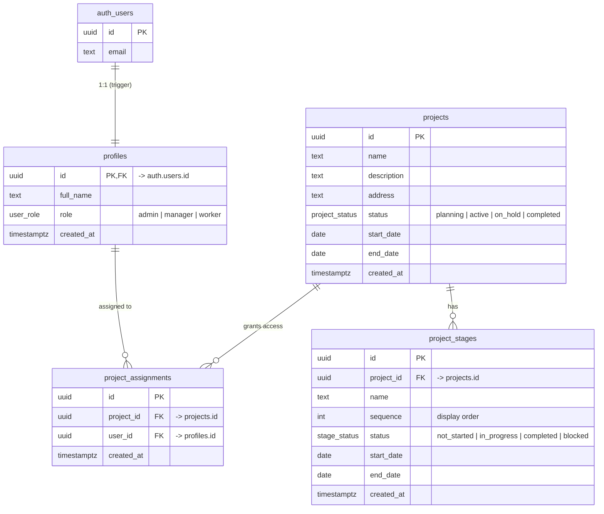

# Construction Projects Portal

A small full-stack app for a construction company: users authenticate with
email/password and see **projects** and their **stages** according to their
**role**.

- **Backend:** Supabase (Postgres + Auth + Row Level Security). Runs locally via
  the Supabase CLI/Docker; the same migrations push to a hosted cloud project.
- **Frontend:** Vite + React 19 + TypeScript (`frontend/`).

## Access model (role-based, enforced by RLS)

| Role      | Sees                                                        |
| --------- | ----------------------------------------------------------- |
| `admin`   | **All** projects and stages; can manage everything          |
| `manager` / `worker` | Only projects they are **assigned** to (via `project_assignments`) and those projects' stages |

New sign-ups start as `worker` with no projects until an admin assigns them.
Access is enforced in the database (RLS policies in
`supabase/migrations/0002_rls.sql`), not just in the UI.

## Prerequisites

- Docker (running)
- Node.js 20+
- Supabase CLI — used here via `npx supabase` (no global install needed)

## Run locally

```bash
# 1. Start the local Supabase stack (Postgres, Auth, Studio, …)
npx supabase start

# 2. Apply migrations + seed demo data
npx supabase db reset

# 3. Point the frontend at the local stack.
#    Copy the ANON_KEY / API_URL printed by `npx supabase status`.
cp frontend/.env.example frontend/.env.local   # then fill in the values

# 4. Run the frontend
cd frontend
npm install
npm run dev        # http://localhost:5173
```

Supabase Studio: http://localhost:54323 · Inbucket (emails): http://localhost:54324

## Demo accounts (from `supabase/migrations/0003_seed_demo_data.sql`)

These are seeded by a migration, so they exist in **both** local (`db reset`) and hosted
(`db push`) databases. On a real deployment, change or remove them — the password is weak and
public.

| Email             | Password       | Role   | Sees                         |
| ----------------- | -------------- | ------ | ---------------------------- |
| `admin@demo.com`  | `Password123!` | admin  | All 3 projects               |
| `worker@demo.com` | `Password123!` | worker | "Riverside Apartments" only  |

## Promoting a user to admin

Roles are only changeable by an admin (or directly in the DB). To make a user an
admin, run in Studio's SQL editor or psql:

```sql
update public.profiles set role = 'admin'
where id = (select id from auth.users where email = 'someone@example.com');
```

To grant a worker access to a project, add an assignment:

```sql
insert into public.project_assignments (project_id, user_id)
values ('<project-uuid>', '<user-uuid>');
```

## Entities & schema

All application tables live in the `public` schema and are defined in
`supabase/migrations/0001_init.sql`. Supabase's built-in `auth.users` table
(managed by Supabase Auth) holds credentials; every other entity hangs off it.

### Relationships



### Tables

**`profiles`** — one row per authenticated user (1:1 with `auth.users`).
Created automatically by the `handle_new_user` trigger on sign-up, pulling
`full_name` from the signup metadata. Holds the user's `role`, which drives all
access decisions.

| Column | Type | Notes |
| --- | --- | --- |
| `id` | `uuid` | PK, FK → `auth.users(id)` `on delete cascade` |
| `full_name` | `text` | from signup metadata |
| `role` | `user_role` | `not null default 'worker'` |
| `created_at` | `timestamptz` | `default now()` |

**`projects`** — a construction project.

| Column | Type | Notes |
| --- | --- | --- |
| `id` | `uuid` | PK, `default gen_random_uuid()` |
| `name` | `text` | `not null` |
| `description` | `text` | nullable |
| `address` | `text` | nullable |
| `status` | `project_status` | `not null default 'planning'` |
| `start_date` / `end_date` | `date` | nullable |
| `created_at` | `timestamptz` | `default now()` |

**`project_stages`** — an ordered phase within a project (e.g. Foundation,
Framing). Rendered on the project detail page sorted by `sequence`.

| Column | Type | Notes |
| --- | --- | --- |
| `id` | `uuid` | PK |
| `project_id` | `uuid` | FK → `projects(id)` `on delete cascade`, indexed |
| `name` | `text` | `not null` |
| `sequence` | `int` | `not null` — display/ordering |
| `status` | `stage_status` | `not null default 'not_started'` |
| `start_date` / `end_date` | `date` | nullable |
| `created_at` | `timestamptz` | `default now()` |

**`project_assignments`** — join table linking a non-admin user to a project
they may see. This is the mechanism behind role-based access: `manager`/`worker`
users only see projects they have a row here for; `admin` bypasses it entirely.

| Column | Type | Notes |
| --- | --- | --- |
| `id` | `uuid` | PK |
| `project_id` | `uuid` | FK → `projects(id)` `on delete cascade` |
| `user_id` | `uuid` | FK → `profiles(id)` `on delete cascade`, indexed |
| `created_at` | `timestamptz` | `default now()` |
| — | — | `unique (project_id, user_id)` |

### Enums

| Enum | Values |
| --- | --- |
| `user_role` | `admin`, `manager`, `worker` |
| `project_status` | `planning`, `active`, `on_hold`, `completed` |
| `stage_status` | `not_started`, `in_progress`, `completed`, `blocked` |

### Access enforcement (RLS)

Row Level Security is enabled on all four tables (`supabase/migrations/0002_rls.sql`).
Two `security definer` helpers keep policies simple and non-recursive:

- `public.is_admin()` — is the current user's profile role `admin`?
- `public.is_assigned(project_id)` — does the current user have an assignment to that project?

Policy summary: `admin` can read/write everything; everyone else can **read**
only their own profile, the projects they're assigned to, and those projects'
stages. Writes to `projects` / `project_stages` / `project_assignments` and role
changes are admin-only.

## Deploy the schema to a hosted Supabase project

```bash
npx supabase link --project-ref <your-project-ref>
npx supabase db push        # applies supabase/migrations/* to the cloud DB
```
Then set `frontend/.env.local` (or your host's env vars) to the cloud project's
URL and anon key. Do **not** run `seed.sql` against production.

## Deploy to production (Supabase Cloud + Dockerized frontend)

Target setup: **database/auth on Supabase Cloud**, **frontend in Docker** on a remote
machine that has only an IP and only HTTP (no domain, no TLS). This works because the SPA
calls Supabase Cloud **directly over HTTPS from the browser** — an HTTP page is allowed to
call HTTPS endpoints (mixed-content blocking is only HTTPS→HTTP), so nginx just serves static
files and no reverse proxy or certificate is needed.

### 1. Backend — schema + auth config via the Supabase CLI

The backend is managed entirely with the CLI, including auth settings — `supabase config push`
applies `supabase/config.toml`'s `[auth]` block to the linked Cloud project, so no dashboard
clicks are needed. First set `[auth]` in `config.toml` for your host:

```toml
[auth]
site_url = "http://<IP>"
additional_redirect_urls = ["http://<IP>"]
enable_confirmations = false   # already set — signup logs the user in immediately
```

Then authenticate and push (get a token from Dashboard → Account → Access Tokens):

```bash
export SUPABASE_ACCESS_TOKEN=<your-personal-access-token>
npx supabase link --project-ref <your-project-ref> -p '<db-password>'
npx supabase db push        # applies supabase/migrations/* to the cloud DB
npx supabase config push    # applies the [auth] block (site_url, confirmations off) to Cloud
```

`config push` syncs the whole supported config, not just those lines — review the diff it
prints before confirming. Fetch the anon/publishable key for the frontend build with:

```bash
npx supabase projects api-keys --project-ref <your-project-ref> -o env
```

`db push` applies `0003_seed_demo_data.sql`, which pre-creates the demo accounts
(`admin@demo.com` / `worker@demo.com`, password `Password123!`) plus demo projects/stages —
so you can log in as admin immediately. **Remove or change these before any real use.** The
`seed.sql` file is intentionally empty (its data moved into the migration).

### 2. Frontend — build and run the container

The Supabase URL and anon key are inlined into the bundle at **build time**, so they are
passed as Docker build args (the anon key is a public client credential — not a secret).

```bash
# On the deploy host, from the repo root:
cp .env.example .env        # then fill in your Cloud URL + anon key
docker compose up -d --build
```

The app is now on `http://<IP>` (port 80). To change the Supabase target later, edit `.env`
and re-run `docker compose up -d --build` (a rebuild is required). Convenience wrappers:
`make deploy_up`, `make deploy_build`, `make deploy_down`.

## Project layout

```
supabase/
  migrations/0001_init.sql   # enums, tables, auth->profiles trigger
  migrations/0002_rls.sql    # grants, is_admin()/is_assigned() helpers, RLS policies
  migrations/0003_seed_demo_data.sql  # demo users, projects, stages, assignment (local + cloud)
  seed.sql                   # empty (demo data moved into 0003)
frontend/src/
  lib/supabase.ts            # typed Supabase client
  context/AuthContext.tsx    # session + profile (role), sign in/up/out
  components/ProtectedRoute.tsx
  pages/Login.tsx, Signup.tsx, Dashboard.tsx, ProjectDetail.tsx
```
